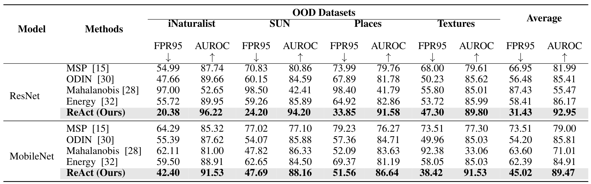

# ReAct: Out-of-distribution Detection With Rectified Activations

This is the source code for paper [ReAct: Out-of-distribution Detection With Rectified Activations](https://openreview.net/pdf?id=IBVBtz_sRSm)
by Yiyou Sun, Chuan Guo and Yixuan Li.

In this work, we propose ReAct—a simple technique for reducing model overconfidence on OOD data. 
Our method is motivated by novel analysis on internal activations of neural networks, which displays highly distinctive 
signature patterns for most OOD distributions. 

## Usage

### 1. Dataset Preparation

#### In-distribution dataset

Please download [ImageNet-1k](http://www.image-net.org/challenges/LSVRC/2012/index) and place the training data and validation data in
`./datasets/id_data/ILSVRC-2012/train` and  `./datasets/id_data/ILSVRC-2012/val`, respectively.

#### Out-of-distribution dataset

We have curated 4 OOD datasets from 
[iNaturalist](https://arxiv.org/pdf/1707.06642.pdf), 
[SUN](https://vision.princeton.edu/projects/2010/SUN/paper.pdf), 
[Places](http://places2.csail.mit.edu/PAMI_places.pdf), 
and [Textures](https://arxiv.org/pdf/1311.3618.pdf), 
and de-duplicated concepts overlapped with ImageNet-1k.

For iNaturalist, SUN, and Places, we have sampled 10,000 images from the selected concepts for each dataset,
which can be download via the following links:
```bash
wget http://pages.cs.wisc.edu/~huangrui/imagenet_ood_dataset/iNaturalist.tar.gz
wget http://pages.cs.wisc.edu/~huangrui/imagenet_ood_dataset/SUN.tar.gz
wget http://pages.cs.wisc.edu/~huangrui/imagenet_ood_dataset/Places.tar.gz
```

For Textures, we use the entire dataset, which can be downloaded from their
[original website](https://www.robots.ox.ac.uk/~vgg/data/dtd/).

Please put all downloaded OOD datasets into `./datasets/ood_data/`.

### 2. Pre-trained Model Preparation

The model we used in the paper is the pre-trained ResNet-50 and MobileNet-v2 provided by Pytorch. The download process
will start upon running.

### 3. OOD Detection Evaluation

To reproduce our results on ResNet-50, please run:
```
python eval.py --threshold 1.0
```

To reproduce baseline approaches (Energy Score), please run:


```
python eval.py --threshold 1e6  #we set the threshold close to infinity, so it is the original energy score.
```


## OOD Detection Results

MOS achieves state-of-the-art performance averaged on the 4 OOD datasets.



## Citation

If you use our codebase, please cite our work:
```
@inproceedings{sun2021react,
  title={ReAct: Out-of-distribution Detection With Rectified Activations},
  author={Sun, Yiyou and Guo, Chuan and Li, Yixuan},
  booktitle={Advances in Neural Information Processing Systems},
  year={2021}
}
```
